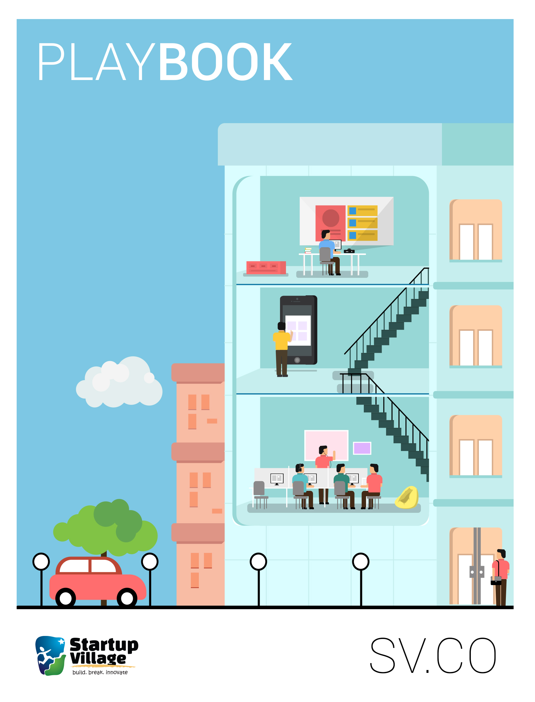



# The Startup Village Playbook

The term *Playbook* originates from the game of football and describes a notebook that contains descriptions and diagrams of the common strategies frequently used by teams. We believe that creating a startup is like a team sport similar to football. The rules of football are simple to learn and the various roles of *forward*, *mid-fielder*, *defender* and *goalkeeper* are easy to understand. When the individuals in the team play together and score more goals than the opposition, they win. However, to become a successful football player with world-class skills takes a lot of practice and cannot be learned by just reading about it.

Creating a startup is just like assembling a professional football team: you learn by doing. To build a championship team, you need great players at each role and the team needs to play together towards a goal or an aim.

This Startup Playbook has the basic rules of how to play the startup game and is a guide for you to continuously refer back to on your startup journey. Like in any sport, the more you practice, the better you become at the game.

## What We Believe

At Startup Village, we think *everyone* can learn to become an entrepreneur. And we think the best time to pick up these skills and build great startups is when you are young, even while you are still in school or college. 

We believe that the Internet is a significant game changer for humanity and we are seeing the early days of a massive global revolution. Because learning as we know it was institutionalised in the early 18th century, schools and colleges are organised just like factories with separate areas for different subjects and they teach topics in order, just like batch production at a factory.

We believe that if Colleges and Universities were built in the Internet Era, Startup Village is how it would possibly look like. While your college might teach you Engineering, we teach you how to build a Startup.

Here's how Startup Village compares to a traditional school or college:

| Area | Colleges & Schools | Startup Village |
|------|--------------------|-----------------|
| Focus | Your primary or **major** area of study | Your secondary or **minor** area of study |
| Admission | Colleges admit an **individual** | Startup Village admits a **team** |
| Learning | **Teachers** and guides lecture you about topics | Mentors help you out, but **self-learning** is emphasized | 
| Duration | A **structured duration** of semesters or thesis evaluations | You **learn at your own pace** and you move ahead when you are ready |
| Evaluation | Theory **exams**, with practical labs | **Practical results** that you produce with your knowhow |
| Graduation | You score above the pass percentile and get a **job**, or you go for **higher education** | **Six ways** to graduate |

This Startup Playbook is curated information that will guide you through the startup journey. This entire book can be read in two weeks but to practice it and become an expert is a life long process. The more you practice, the more skilled you become. There is no need to memorise anything. There is no need to learn formulae by heart. Everything is available on the Internet and you can check any video or web link at any point of time.
 
There is no need to be apprehensive of a final exam. Building a startup is a continuous creative process. You become better at this with the more experienced you get. Close to no one gets it right in the first try and thus you need to keep releasing the product and keep iterating it over. The best version of Android is always the next one: perfection is a work in progress.

Building a Startup is a creative adventure and is the perfect mix of Science, Arts & Humanties. As you get exposed to these diverse fields, your options in life also increase with the new skills and experiences you gain while you build a startup.

## Six Ways to Graduate

At Startup Village, we give you six ways to successfully graduate:

1. **Get funded**
  
  Your startup gets funded through a venture capital firm or an angel investor.
2. **Get into a Startup Accelerator**

  Your team is selected into a recognized Startup Accelerator.
3. **Get Aqqui-Hired**

  Your founding team is hired on by another company that values your skills.
4. **Become Self Sustainable**

  Your revenue and cashflows stabilize and then grow, allowing you to scale up.
5. **Get a job**

  You get hired at a great company because of the skills that you acquired while building your startup.
6. **Go for Higher Education**

  You decide to build upon the skills you acquired by getting a formal degree.
  
At Startup Village, all of these are perfectly happy outcomes. We think the much hyped story of a founder striking it big from his garage is good press, but building a startup can be about *much more* than a good exit. If you are one of those few founders who make it big, great! But we are happy with any and all of these outcomes.

## Next Steps

Hope that gives you a good soundbite. The rest of this playbook is in two parts. The first: about how the Startup Village application process works, and how we guide and evaluate startups. You'll also learn about features like *Startup Timelines* that allow you to accurately record progress in your Startup journey. 

The second & longer part is about stages in the life of a startup, typical activities you perform, and learning resources that are available to help you out. You'll gain an understanding of the five stages involved in any startup, and the five roles we think are crucial in any startup team.

You needn't read this playbook cover to cover. Instead, focus on the areas that seem interesting to you and read just that.

Read on to join this amazing adventure. Your next step is to [apply](1-application.md).
