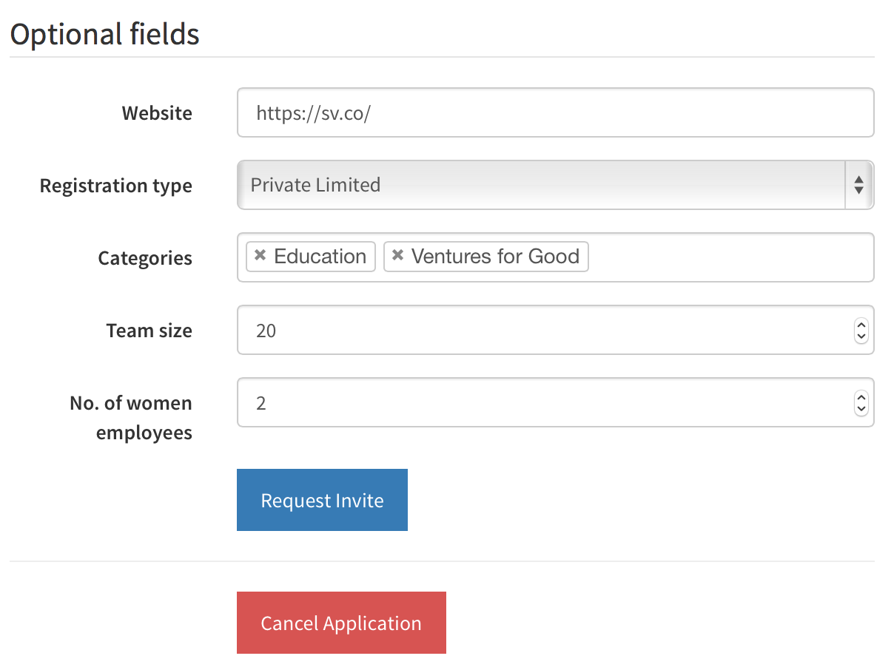
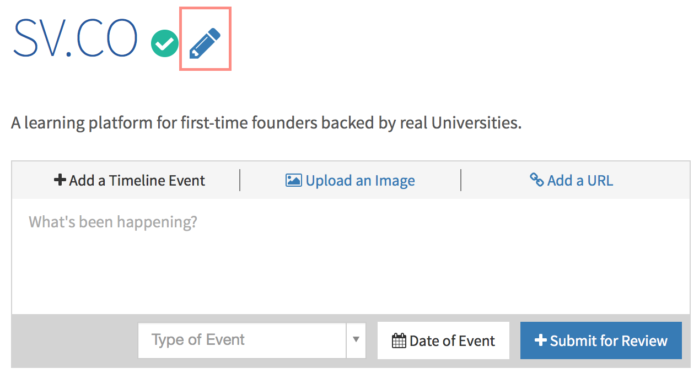
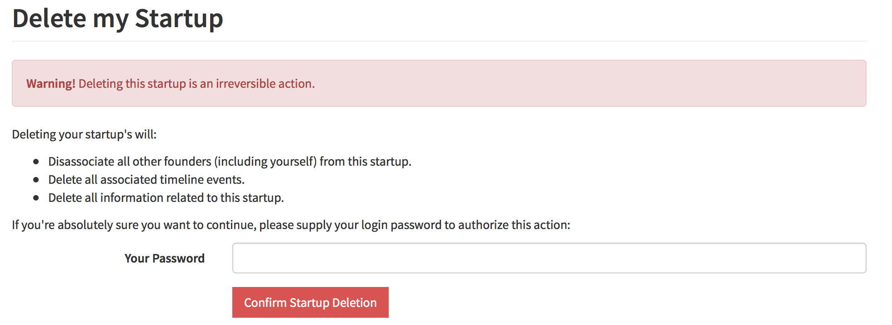



# Frequently Asked Questions

These are questions startups & founders[^1] ask us often about SV.CO. We decided to collate them here so that we don't have to repeat ourselves often. If you got pointed here by a response from help@sv.co, do feel free to ask us questions if the replies here aren't satisfactory!

<cite id="q-top"></cite>
## Questions

### General SV.CO Questions
1. [What should I include in the Deck during application submission?](#q1-1)
2. [My co-founders accidentally created a startup application of their own. And I can't add them as co-founders now. How do I fix it?](#q1-2)
3. [How are we guided and mentored?](#q1-3)
4. [Can I use a slide hosting service like Prezi instead of SlideShare, Speakerdeck et. al.?](#q1-4)
5. [Can you tell us more about the Gujarat University Scholarship?](#q1-5)
6. [Are we required to stick to the existing idea that we chose initially or do we have the freedom to explore into new areas?](#q1-6)
7. [How is our work to be tracked so as to ensure we are going at a proper pace?](#q1-7)
8. [The playbook has detailed timing for each stages of a startup. Should we also follow this timing exactly?](#q1-8)
9. [How do I edit my timeline?](#q1-9)
10. [Should we build the exact replica of our assigned idea or are we free to add our own innovations to it?](#q1-10)
11. [What happens if we have to change the roles we chose?](#q1-11)
12. [As mentioned in the agreement, if we are to get a job through this program, what is the time period that we have to pay SV.CO 10% of our annual salary? Is it for one year or more? If we do not accept the job offer, do we need to pay the amount?](#q1-12)

### Fintech Box Questions

These questions are more relevant to the [Fintech Box](http://startupstudio.co.in/startupbox) programme.

1. [We're part of the Fintech Box program. Do we also get to be part of the GTU program?](#q2-1)
2. [I'm part of the Fintech Box program. Is it compulsory for us to attend the GTU program and pay the semester fees of Rs 15,000?](#q2-2)
3. [How can Startup Village help us in raising investment? The present problem we face are lack of a server and development tools.](#q2-3)
4. [We're part of the Fintech Box programme. We would like to know the terms and conditions of the product that we will be developing ie; the ownership of the product once launched, as well as how Federal Bank will be associated with the product. Also will we be receiving technical assistance from the bank?](#q2-4)
5. [Since we are joining through the Fintech Box program, what all changes will be there in our startup life cycle stages?](#q2-5)
6. [Are we now part of SV.CO? If yes, do you expect us to graduate within 6 months? Do we have to pay the semester fees mentioned?](#q2-6)
7. [Can our team use the Startup Facility for the purpose of building our product? If so, then are there any formalities which we should be worried about? When can we start using FabLab?](#q2-7)
8. [Is it necessary that the product has to be related to Federal Bank?](#q2-8)
9. [What happens if we break the device or lose it? Do we have to buy you guys a new one?](#q2-9)
10. [After the six months duration of the program, will our team receive any support from SV? after the course?](#q2-10)
11. [Is the Legal Agreements given in the Playbook also meant for us or is it meant only for students of GTU only?](#q2-11)
12. [What is the Validity Period of the legal agreements?](#q2-12)
13. [What if we were hired outside of Startup Village?](#q2-13)
14. [Do we have a free exit after 6 months?](#q2-14)

### Student Entrepreneurship Policy Questions
1. [I'm a student outside Kerala, can I avail these benefits?](#q3-1)
2. [How long will I have to wait to receive the benefits?](#q3-2)
3. [How are the grace marks distributed?](#q3-3)
4. [The Internal component of my grade has marks reserved for attendance. Will the SEP grace marks apply to that?](#q3-4)
5. [If I have back-papers am I eligible for this benefit?](#q3-5)
6. [Will this benefit apply to supplementary or improvement papers?](#q3-6)

## General SV.CO Questions

<cite id="q1-1"><cite>
1. What should I include in the Deck during application submission?

   There is a great guide to what to include in [our Deck writeup](stages/5.1.1-deck.md). [↵](#q-top)
<cite id="q1-2"></cite>   
2. My co-founders accidentally created a startup application of their own. And I can't add them as co-founders now. How do I fix it?

   If they haven't yet submitted their application, ask your co-founders to click "Cancel Application" 
   
   
   
   If they have submitted their application, ask your co-founders to delete their startup in their Startup Timeline.
   
   
   
   The Delete Startup is at the bottom of that page:
   
    [↵](#q-top)
<cite id="q1-3"></cite>
3. How are we guided and mentored?

   The SV.CO programme is intended as a self-learning platform for first-time founders. The Playbook provides a structured approach to developing products and defines stages that startups have to advance through & roles that every startup should have. Bi-weekly office hours with the Startup Village faculty, beginning with Engineering, Product and Marketing & Sales sessions will be part of the programme. [↵](#q-top)
<cite id="q1-4"></cite>
4. Can I use a slide hosting service like Prezi instead of SlideShare, Speakerdeck et. al.?

   Of course. You can even specify a link to a PDF/PPT file you host somewhere. The idea is to have a permanent link, we're not particularly concerned about where you host it. [↵](#q-top)
<cite id="q1-5"></cite>
5. Can you tell us more about the Gujarat University Scholarship?

   There is now a new page in the Playbook that talks about the [GTU partnership](1-partnership.md). [↵](#q-top)
<cite id="q1-6"></cite>
6. Are we required to stick to the existing idea that we chose initially or do we have the freedom to explore into new areas?

   You can and probably will pivot. It’s up to you to make your startup a success. Don’t give up too soon though, and without great reasons. The [Idea Discovery section](stages/5.1-idea-discovery.md) has a lot more detail about questions such as these. [↵](#q-top)
<cite id="q1-7"></cite>
7. How is our work to be tracked so as to ensure we are going at a proper pace?

   Through the [Verified Timeline](3-verified-timelines.md), which will also form the basis of a Transcript from our [GTU partnership](1-partnership.md). [↵](#q-top)
<cite id="q1-8"></cite>
8. The playbook has detailed timing for each stages of a startup. Should we also follow this timing exactly?

   Startups advance at their own pace. The timing mentioned in the Playbook is just indicative of the average times founders usually take. The programme is milestone based (i.e. have you achieved everything to move up a stage?) and not time-bound. [↵](#q-top)
<cite id="q1-9"></cite>   
9. How do I edit my timeline?

   Our timeline builder is still WIP. We'll have it ready soon! [↵](#q-top)
<cite id="q1-10"></cite>   
10. Should we build the exact replica of our initial idea or are we free to add our own innovations to it?

   Do you want a search engine just like Google? Or do you want to build something better? [↵](#q-top)
<cite id="q1-11"></cite>
11. What happens if we have to change the roles we chose?

    What happens when the CEO of Google changes? [↵](#q-top)
<cite id="q1-12"></cite>
12. As mentioned in the agreement, if we are to get a job through this program, what is the time period that we have to pay SV.CO 10% of our annual salary? Is it for one year or more? If we do not accept the job offer, do we need to pay the amount?

    You have to pay 10% CTC for the first year. If you don’t take up the job offer, you don’t have to pay SV.CO anything. Our fee is based on the model that when you succeed, we do. [↵](#q-top)

## Fintech Box Questions

<cite id="q2-1"></cite>
1. We're part of the Fintech Box program. Do we also get to be part of the GTU program?

   Yes! Everybody who is part of SV.CO is also part of the GTU program. [↵](#q-top)
<cite id="q2-2"></cite>
2. I'm part of the Fintech Box program. Is it compulsory for us to attend the GTU program and pay the semester fees of Rs 15,000?

   It is compulsory to be part of the GTU programme. However, it’s automatic and no additional work has to be done. Your verified timeline will automatically be part of the GTU transcript at the end of the programme. However, because the Box programme is 6 months, you might not achieve any of the results required for a GTU specialization or certificate. That is fine! You can continue the programme at SV.CO even after you have returned the Fintech Boxes.

   For the Box campaign we are offering scholarships that will cover the Rs. 15,000 fee. [↵](#q-top)
<cite id="q2-3"></cite>
3. How can Startup Village help us in raising investment? The present problem we face are lack of a server and development tools.

   There is  a seed fund available with limited funds. In addition, Startup Village also has access to AWS credits for server hosting. Please write to help@sv.co once you have [signed agreements](2-legal-agreement.md). [↵](#q-top)
<cite id="q2-4"></cite>
4. We're part of the Fintech Box programme. We would like to know the terms and conditions of the product that we will be developing ie; the ownership of the product once launched, as well as how Federal Bank will be associated with the product. Also will we be receiving technical assistance from the bank?

   Yes, you will be receiving assistance from the bank and will have interactions with their team. Federal Bank is a great partner as they are open to new products and have set up a cross-division team to simplify approvals.

   All product intellectual-property will be owned by your startup. Federal Bank usually asks for a limited period of exclusivity and first-right of refusal for investing into your startup. [↵](#q-top)
<cite id="q2-5"></cite>
5. Since we are joining through the Fintech Box program, what all changes will be there in our startup life cycle stages?

   You will go through the [stages as described in the Playbook](5-startup-stages.md). [↵](#q-top)
<cite id="q2-6"></cite>
6. Are we now part of SV.CO? If yes, do you expect us to graduate within 6 months? Do we have to pay the semester fees mentioned?

   See Q1 and Q2 too. You are not expected to graduate within 6 months. The Fintech Box programme will be over at the end of 6 months, and you will have to return the boxes. You can continue being part of SV.CO. [↵](#q-top)
<cite id="q2-7"></cite>
7. Can our team use the Startup Facility for the purpose of building our product? If so, then are there any formalities which we should be worried about? When can we start using FabLab?

   You can use the Startup Village facilities, including space and the Fab Lab. However, space available is limited and on a first-come first-serve basis. Please write to help@sv.co to get access to the FabLab. [↵](#q-top)
<cite id="q2-8"></cite>
8. Is it necessary that the product has to be related to Federal Bank?

   No. It has to be in the Fintech domain because then Startup Village and its host institute MobME Wireless can help you. [↵](#q-top)
<cite id="q2-9"></cite>
9. What happens if we break the device or lose it? Do we have to buy you guys a new one?

    The contents in the box are quite valuable & distributed by Kerala Startup Mission so please don’t break or lose it. If you do, yes, you’ll have to pay an equivalent amount. [↵](#q-top)
<cite id="q2-10"></cite>
10. After the six months duration of the program, will our team receive any support from SV? after the course?

    You will become a regular incubatee of SV.CO & will receive all of the benefits of that programme. Aside from the fact that you will have to return the boxes, nothing much changes. [↵](#q-top)
<cite id="q2-11"></cite>
11. Is the Legal Agreements given in the Playbook also meant for us or is it meant only for students of GTU only?

    The [legal agreements](2-legal-agreement.md) are meant for everybody who is part of SV.CO. [↵](#q-top)
<cite id="q2-12"></cite>
12. What is the Validity Period of the legal agreements? 
    
    The validity period is 5 years. See "Term and Termination" in [legal agreements](2-legal-agreement.md). [↵](#q-top)
<cite id="q2-13"></cite>
13. What if we were hired outside of Startup Village?

    Then you don’t have to pay SV.CO anything. If we help you get a great job, you pay us. Our fee is success-based. [↵](#q-top)
<cite id="q2-14"></cite>
14. Do we have a free exit after 6 months?

    The validity period of the [legal agreements](2-legal-agreement.md) that you sign is 5 years. You can exit after 6 months if you decide to shut down your venture. Or you can pivot to new ideas and continue being part of SV.CO after returning the boxes. All other benefits remain the same and we will keep supporting you. [↵](#q-top)

## Student Entrepreneurship Policy Questions
<cite id="q3-1"></cite>
1. I'm a student outside Kerala, can I avail these benefits?
   
   No. Only students in Kerala are currently eligible. We have a detailed guide to the [Kerala SEP program](1.3-kerala-sep.md). [↵](#q-top)
<cite id="q3-2"></cite>
2. How long will I have to wait to receive the benefits?

   It depends on your University. We've noticed that it takes a minimum of 2 months to complete the process. [↵](#q-top)
<cite id="q3-3"></cite>   
3. How are the grace marks distributed?

   This is up to the University, but we've noticed that they tend to distribute marks equally amongst the Theory component of your grade. [↵](#q-top)
<cite id="q3-4"></cite>   
4. The Internal component of my grade has marks reserved for attendance. Will the SEP grace marks apply to that?

   See question 3. Usually, the answer is a no. SEP grace marks only apply to the Theory component. [↵](#q-top)
<cite id="q3-5"></cite>   
5. If I have back-papers am I eligible for this benefit?

   Yes. As long as you are a student of the University for that particular semester, you are eligible. [↵](#q-top)
<cite id="q3-6"></cite>   
6. Will this benefit apply to supplementary or improvement papers?

   Yes, once you receive this benefit, it will apply to any exams you might have in that particular semester, including improvements and supplementary exams. Obviously, this benefit wouldn't carry on to exams in other semesters. You need to apply individually for other semesters. [↵](#q-top)

---
[^1]: All questions are from the point of view of the founders.