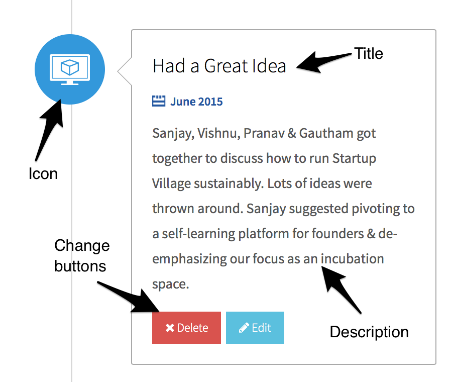
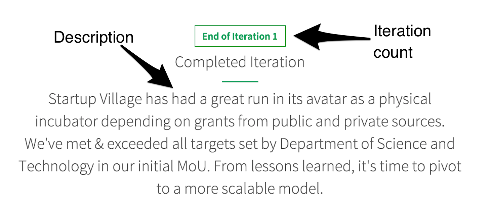
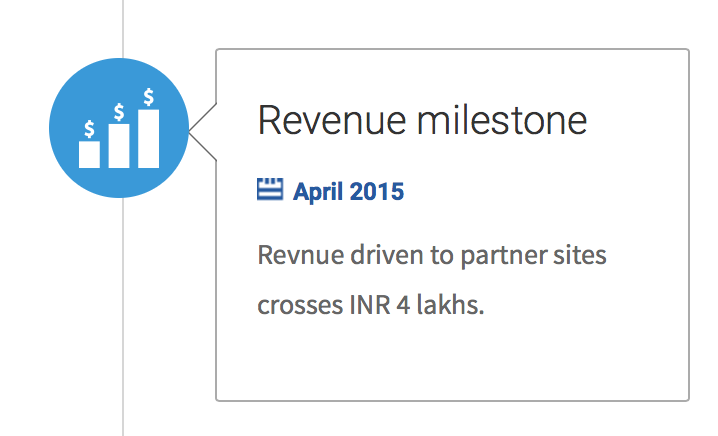
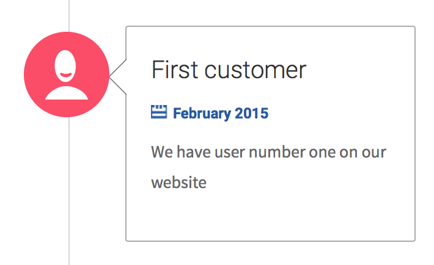
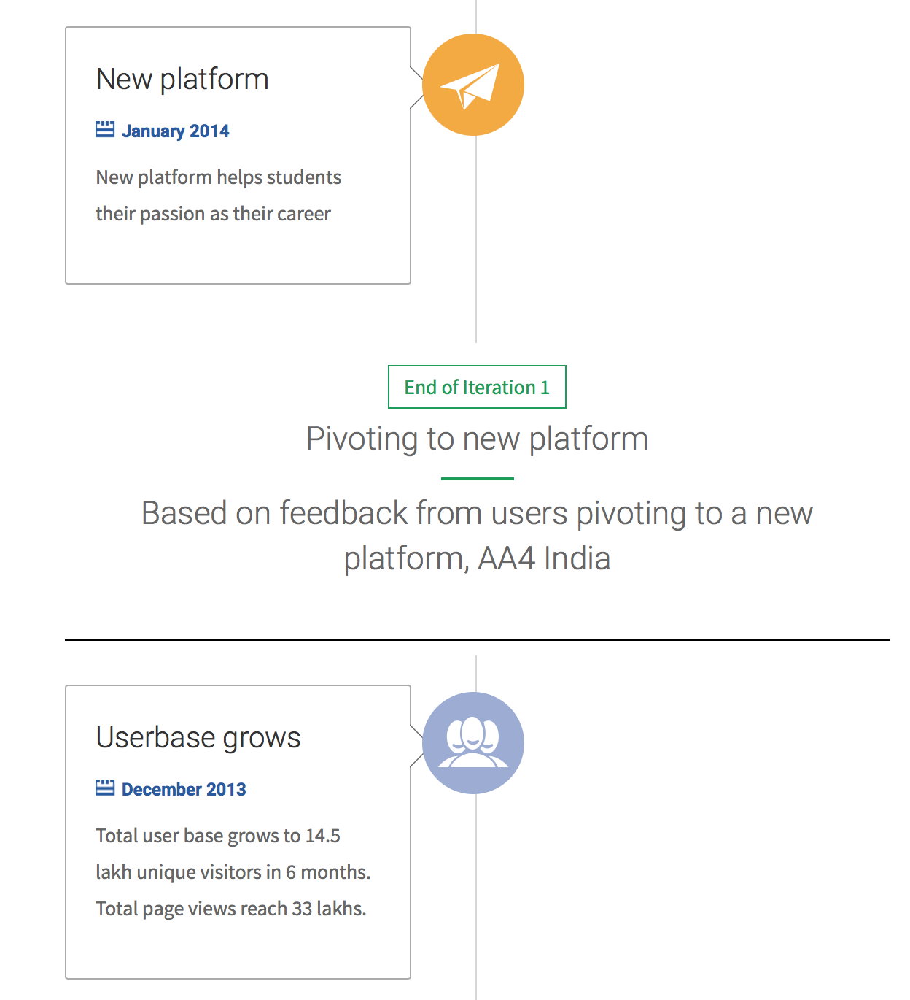

# Verified Timelines

Verified timelines are aimed at tackling one of the biggest problems a new entrepreneur faces: uncertainty (or "What do I do now?"). When used correctly, the Verified Timeline is like your startup compass pointing to true North for your journey and gives you answers to these three questions:

1. What should my team be focused on right now?

   The most frequent question that entrepreneurs ask mentors is: "What do you think I should do now?" Timelines provide a set of *common activities* that startups should and more importantly, *should not do* at particular stages.

1. What will my startup journey look like?
   
   Teams at the start of every entrepreneurship journey have a lot of incorrect assumptions. Starting a company is rarely a get-rich-quick scheme. In fact, most entrepreneurs fail a lot of times before finding a correct product-market fit. By exploring timelines of other startups, you'll be able to understand how they succeeded: often only after multiple iterations.
   
   In addition, setting expectations right for your team is important from day one, and verified timelines help you do that.

3. What help will I receive from Startup Village at my stage?

   Because startups are part of the SV.CO platform, they receive numerous benefits and incentives. As they move through stages, new benefits and resources open up. These could be diverse things like access to funding rounds, connections with mentors or access to our new FAB Lab. The platform and our representatives keep you updated with the latest benefits you can apply for.
   
## Timelines in Brief

This is what a typical timeline looks like:

There are a few concepts you should understand:

* **Timeline events** are notable milestones in your startup journey. These could be for example: a team member joining, a fundraising event, legally incorporating your startup, or developing a new prototype. All timeline events are verified by Startup Village.
* **Iterations** are different versions of your product. You may perhaps start with one idea and decide that a part of it is not working as intended, and then launch an improved version to test.
* **Pivots** happen when you launch a new product because your old one wasn't achieving traction or growth. Pivots are common, and often a useful tool to focus your team on a different idea.
* **Stages** are different parts of your startup journey. At SV.CO [we support startups through five stages](5-startup-stages.md). Note that when you pivot and start a new iteration you might go back a stage. This is perfectly OK! As an example, a team can develop an idea until the Scaling stage and decide that while they have some customers, the product is too hard to scale. They can then go back to the drawing board, refine the idea based on their learnings & new skills and build a new product entirely. In fact, this is encouraged. Your goal is to find an idea and take it through the five startup stages.

Here are few example of common timeline events:

Here's how an iteration is represented, and where a pivot happens:

Here's when a team moved back from a Customer Validation stage back to the Idea Discovery stage:

## Keep your Timelines Updated

This is the single most important piece of advice you'll receive as part of the SV.CO program: make sure your timeline data is in sync with your startup.

There are several reasons that entrepreneurs usually think up *not to* update their timelines. All of these are the wrong reasons:

1. Your current idea is not getting traction and you are looking for that one big break before you update your timeline.

   One of the indicators that we rank startups in internally is velocity, or how fast they move within and between stages. One of the best correlations that we've found for successful startups is to find folks who always communicate: in good times and bad. It doesn't matter if your product is not achieving customer validation. Perhaps you have added a business partner to help you explore more options? Or you've pivoted to a different sector? Communicate through your timelines. It's very important that you do. We **recommend you update your timelines every week**.

2. There's nothing happening that is important enough to update.

   While there are lulls in any startup, a continuous period of inactivity is a danger signal. Perhaps you need to rethink your approach? Good startups are continously in motion, building enough momentum to move from one stage to the next. If you are not moving, you don't generate momentum.

3. Some of my founders left and I'm struggling to make ends meet.

   Adversity affects every startup. Again, please see point 1. Communicate in good times and bad. 
   
   Also please note that we have six avenues to graduate. Please talk to your SV.CO representative and figure out more options.
   
In fact if there's one good reason to not update your timelines it's that there's something exciting happening to you that you'd like to update but it's something that we don't currently verify. Startups continously do new things. There might be a new event in your journey that is important but we may not have that as an *event* in our database. Please talk to your SV.CO representative and let's add that timeline event in.

## Verified Timeline Events

Here's an exhaustive list of timeline events we record and verify:

| Event | Description | Additional Details Required for Verification |
| ----- | ----------- | -------------------------------------------- |
| Founded | This is to record when you founded your company | List cofounder details, and for bonus points, their resume |
| A Key Team Member Joined | This is to record when a key team member joins (perhaps a great sales person?) | List key team member details, and for bonus points, their resume |
| Co-Founder Left | This is to record when a cofounder leaves your startup. | List the cofounder who left |
| Legally Incorporated | This is when you legally incorporate, as an Private Limited or a Partnership | Copy of the Partnership Deed or Private Limited Registration Details |
| Accelerator program | This is when you are formally accepted at a recognized startup accelerator program. | Copy of the acceptance email from accelerator. |
| Acquired by | This is when you get acquired by another company. | Copy of the acquisition details including deal details. | 
| Applied for patent | This is when you apply for a patent. | Copy of the patent application details. |
| Associated with SV | This is when you successfully apply to Startup Village | This is an automatic event generated when you first join Startup Village | 
| Attended Event |  This is to record your team attending a notable event | Copy of invites or tickets | 
| Collaboration | This is when you collaborate with another startup or a company | Copy & details of collaboration |
| Developed the First Prototype | This records your first prototype creation | A demonstration of your prototype. |
| Mentor Joined | This is when a mentor decides to advise your team | Details of the Mentor, their LinkedIn or Angelist profile and for bonus points, their resume | 
| Monthly revenue crossed | This is when you cross an internal revenue milestone | A copy of your invoice records or a self-signed or internally audited P&L statement |
| Pivot | When you change your product to a new one | A record of what went wrong with your previous try, and why you are pivoting to this new product |
| Product Iteration | When you refine or add new features to an existing product | A record of what was working & not with your previous iteration and what you think will work in this new version |
| Raised Angel Funding | When you raise funding from an angel investor | Details of the funding round and investor details |
| Raised Series A Funding | When you raise funding from a professional equity investor | Details of the funding round, including term sheets and pre & post-money valuations in addition to detailed investor details |
| Received Seed Fund | When you receive a seed fund for a particular purpose | Details of the seed fund received |
| Received Soft Loan | When you receive a low-interest loan | Details of the loan received and issuing entity |
| Relocate to City | When you decide to relocate your team | Details of your old and new offices and why you decided to relocate |
| Sets Mission | When you set a new mission for your team | Details of your old and new mission, and why the change |
| Showcase | When your product gets showcased at a notable media outlet | Link to the showcase and why it's notable |
| Won Award | When your product or your startup wins an award | Link to the award and why it's notable |

## Next Steps

That's the quick overview of our most important feature: Verified Timelines. Currently, you update your timelines by notifying your SV.CO representative about major timeline events, but we have an exciting timeline editor in the works.

This concludes Part 1 of our playbook. Next, we talk about [Startup Roles](4-startup-roles.md).
