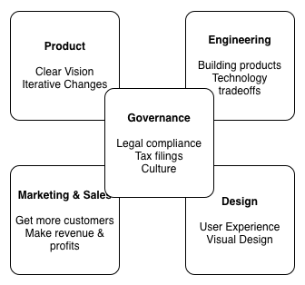



# Startup Roles

In a good startup, founders pay attention to five roles:

* Product

  The Product role is about having a clear vision for the product and then detailing it out ("What are you building?") & guiding it through constant iterative changes.

* Engineering

  The Engineering role builds out the product and understands business and technology tradeoffs.

* Marketing & Sales

  The Marketing and Sales role is where you figure out how to continuously get your product to more customers and make revenues and profits.

* Governance

  As startups are real world businesses, there are rules to follow about how to conduct your business. Governance is about ensuring your team is compliant with these rules such as legal registrations, agreements, and tax filings. Governance also ensures that the organisation has a great culture.

* Design

  The Design role thinks deeply about user experience and visual design of the product.
  
  

It's a cohesive working of these five roles that builds a good startup team and subsequently, a great product.

## Can I Wear Multiple Hats?

In a small startup team, it's the norm for a founder to wear multiple hats. As an example, perhaps the Product person is also the Engineer who bootstraps the product. Or one founder takes care of both the Marketing & Sales roles and Governance. While we think this practice is okay, we can't stress the importance of having these role distinctions learnt from day one. And as startups mature, towards the latter stages, most of these roles become full-time jobs.

Role groupings that usually go together:

* Engineering heavy teams usually have one person working on both the *Engineering* and *Product* roles.
* Design-led teams usually combine *Product* and *Design* roles.
* Business heavy teams usually have *Product* and *Marketing & Sales* being done by the same person.

How do you pick a role? We think it's best to follow your passion:

* If you've always been excited about programming, pick the Engineering role. But do realize that good Engineering is not just about staring at code, but also about understanding how best to translate great code into real-world business outcomes.
* If you are excited about new ideas and products or have a deep desire to create something new and make an impact in the world, you might be fit for the Product role.
* If you are an extrovert who loves to talk and meet new people, the Marketing & Sales role might be for you. However, a good marketing person also has great analytical skills and is able to build a logical and sensible sales plan.
* If you have an interest in finance or law, you should pick the Governance role.
* If you have a background in Design, it's obvious which role you should pick.

Another important note: for us, designations don't matter, roles do. What does this mean? You might call yourself a CEO, but if you are not performing one of the five roles above, then you are not adding value to your startup. Titles matter not at all except on your business card[^1].

## Next Steps

What's the most important role? It's surprising how often we hear this question from young entrepreneurs. The answer should be obvious: all of them are. But that probably reads as a non-answer to you. The reason for this is that the importance of roles increases and decreases as we move between stages. In the Idea Discovery stage for example, the Product person has a very important role to play to flesh out the product and its iterations. Similarly, the Prototype stage cannot be completed without an effective Engineer. Does this mean that in these stages the other roles are sitting idle?

As we'll see, every role plays a crucial part in every stage. Let's now talk about [Startup Stages](5-startup-stages.md).

---
[^1]: At [Pixar](http://pixar.com/), one of the best animation studios in the world, employees are free to choose their own designation. It's the work you do that matters, not what you call yourself.
