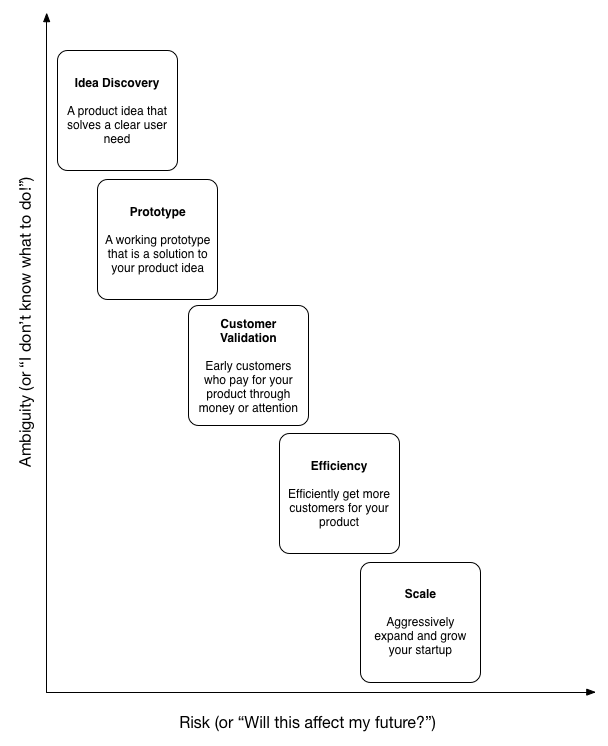

# Startup Stages

Every successful startup grows through a series of stages. We have used this as the foundation of the SV.CO Platform. We've modeled this closely on Marmer Stages[^1] but added in a stage specifically for prototyping because we think it's a crucial intermediary step towards good product development.

At Startup Village, we guide founders through a five-stage process in creating a great startup:

* [**Idea Discovery**](stages/1-idea-discovery.md)

  Idea Discovery is when the founders discover a product idea that solves a clear user need.
* [**Prototyping**](stages/2-prototyping.md)

  At the Prototype Stage, you develop a working prototype that is a solution to your product idea.
* [**Customer Validation**](stages/3-customer-validation.md)

  At the Customer Validation Stage, you find early customers who pay for your product through money or attention.
* [**Efficiency**](stages/4-efficiency.md)

  In the Efficiency Stage, you are finding a way to efficiently get more customers for your product that can lead to a predictable business model.
* [**Scale**](stages/5-scale.md)

  In the Scaling stage, you are trying to aggressively expand and grow your startup.

As you move across stages, ambiguity decreases, and risk increases:

Some important points to note before we proceed:

* One insight that we have had by observing many startups is that as they grow through the various stages, their priorities as a team has to change to what is needed most for success in that stage. A lot of startups fail because they have the wrong priorities for their stage.  What we've tried to do through the SV.CO platform is to help the startup identify what stage they are in, and then provide resources that are helpful to them at that particular stage.
* Startups also rarely move unidirectionally: instead most move through multiple iterations and pivots before they achieve scale. We've noticed that most startups that succeed go through more than two pivots and persevere through multiple iterations before their product hits customer validation. It's probable that a first-time founder will spend two years just reworking his original idea.
* Do keep in mind that as we've mentioned before, at Startup Village, there are [six ways to succeed](introduction.md).

## Next Steps
Let's move on to describing the first stage: [Idea Discovery](stages/1-idea-discovery.md).

[^1]: Startup Genome Report: [PDF Version](https://s3.amazonaws.com/startupcompass-public/StartupGenomeReport1_Why_Startups_Succeed_v2.pdf).
